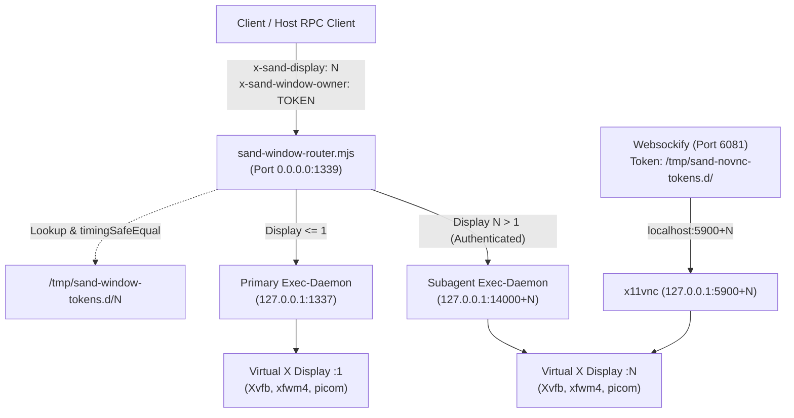
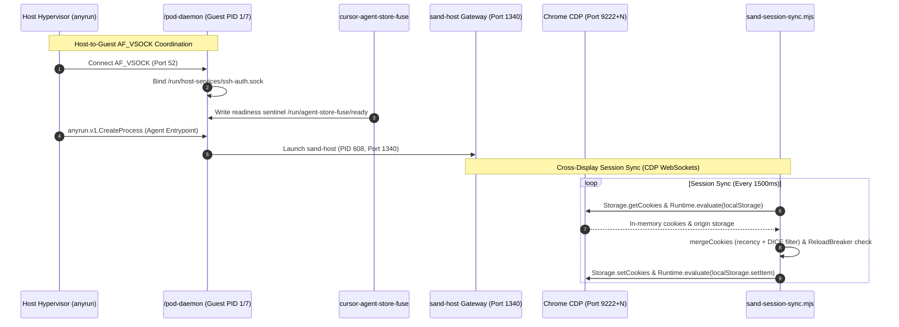

# MicroVM Agent Execution Environment Architecture

## Abstract

This document provides the authoritative, deeply technical architectural specification of the autonomous agent execution environment hosted within the Firecracker microVM container runtime (`sand` / `@anysphere/exec-daemon-runtime`). The system coordinates autonomous agents, federated agent collectives, headless X11 graphical desktops, browser automation engines, and sandboxed developer toolchains. 

The architecture enforces five orthogonal isolation boundaries—process, visual display, network loopback, storage permissions, and Node.js worker-thread concurrency—while providing real-time session synchronization, declarative team environment convergence, and low-latency hypervisor coordination over virtual sockets (`AF_VSOCK`).

---

## 1. Architectural Overview & System Topology

### 1.1 MicroVM Hardware & Operating Context

The guest execution environment runs within an optimized Firecracker microVM executing Linux kernel 6.12 (`system-specs/kernel/cmdline.txt` parameter string: `console=ttyS0 root=/dev/vda earlyprintk=ttyS0 panic=-1 rw`). The microVM boots directly from a root filesystem disk image (`/dev/vda`) with virtual socket services (`PF_VSOCK`) registered during early kernel initialization (`[ 0.257604] NET: Registered PF_VSOCK protocol family` in `system-specs/kernel/dmesg.txt`).

Within the guest OS, the root supervisor daemon is `/pod-daemon` (PID 1 / PID 7 in `system-info/processes.txt`), running under `/tini`. Process execution is compartmentalized between:
1. **Unprivileged Guest Space (`box` user, UID 1000)**: Houses interactive GUI sessions, headless X displays, browser automation nodes, and language toolchains.
2. **Privileged System Space (`root`, UID 0)**: Manages cgroup v2 partitioning, loopback network interfaces, supervisor daemons, and hypervisor-facing IPC bridges.

### 1.2 System Topology & Interaction Planes

```
                                 HOST HYPERVISOR BOUNDARY
==========================================================================================
                                            │
                                            │ AF_VSOCK (Port 52) / anyrun.v1 RPC
                                            ▼
┌────────────────────────────────────────────────────────────────────────────────────────┐
│ GUEST OS MICROVM (Linux 6.12, /dev/vda)                                                │
│                                                                                        │
│  ┌──────────────────────────────────────────────────────────────────────────────────┐  │
│  │ pod-daemon (PID 1/7, Root Supervisor)                                            │  │
│  │ - AF_VSOCK Port 52 Bridge -> /run/host-services/ssh-auth.sock                    │  │
│  │ - anyrun.v1 Protobuf RPC: CreateProcess, AttachProcess, StreamMetrics, Filesystem│  │
│  │ - Blocks container entrypoints on FUSE ready sentinel: /run/agent-store-fuse/ready│  │
│  └────────────────────────────────────────┬─────────────────────────────────────────┘  │
│                                           │ Spawns & Supervises                        │
│                                           ▼                                            │
│  ┌──────────────────────────────────────────────────────────────────────────────────┐  │
│  │ sand-host Gateway (PID 608, host-main.cjs) on 0.0.0.0:1340                       │  │
│  │ - Connect-RPC Management Plane (createGroup, sendPrompt, promptAcceptanceStatus) │  │
│  │ - Persistent State: system-specs/custom-configs/sand-data/                       │  │
│  │ - Worker Thread Pools: AgentWorkerPool (Store) & TranscriptMirrorOffloadPool     │  │
│  └────────────────────────────┬─────────────────────────────┬───────────────────────┘  │
│                               │                             │                          │
│          Worker Thread IPC    │                             │ HTTP Reverse Proxy       │
│          (ArrayBuffer/UDS)    ▼                             ▼ (Port 1339)              │
│  ┌──────────────────────────────────────┐     ┌─────────────────────────────────────┐  │
│  │ Node.js Worker Thread Isolates       │     │ sand-window-router.mjs (Port 1339)  │  │
│  │ - agent-store-worker.cjs (1:1 per bot│     │ - Header Auth: x-sand-display       │  │
│  │   managing conversation-blobs.db)    │     │   and x-sand-window-owner           │  │
│  │ - transcript-mirror-worker.cjs (Pool │     │ - Constant-time timingSafeEqual     │  │
│  │   mirroring JSONL transcripts)       │     │ - Resolves upstream 1337 / 14000+N  │  │
│  └──────────────────────────────────────┘     └──────────┬──────────────────────┬───┘  │
│                                                          │                      │      │
│                     ┌────────────────────────────────────┘                      │      │
│                     │ Display <= 1 (Port 1337)                                  │      │
│                     ▼                                                           │      │
│  ┌──────────────────────────────────────────────┐                               │      │
│  │ Primary Agent Display Environment (:1)       │                               │      │
│  │ - Exec-Daemon: 127.0.0.1:1337                │                               │      │
│  │ - PTY WebSocket: 127.0.0.1:1338              │                               │      │
│  │ - Xvfb / xfwm4 / picom on :1                 │                               │      │
│  │ - x11vnc on 127.0.0.1:5900 (novnc on 6080)   │                               │      │
│  │ - Chrome Profile: /home/box/chrome-profile   │                               │      │
│  │ - Chrome CDP: 127.0.0.1:9223                 │                               │      │
│  └──────────────────────┬───────────────────────┘                               │      │
│                         │                                                       │      │
│                         │                Display N >= 2 (Port 14000 + N)        │      │
│                         │                ───────────────────────────────────────┘      │
│                         │                ▼                                             │
│                         │  ┌────────────────────────────────────────────────────────┐  │
│                         │  │ Forked Subagent Display Environments (:N, N in {2..32})│  │
│                         │  │ - Exec-Daemon: 127.0.0.1:(14000 + N)                   │  │
│                         │  │ - PTY WebSocket: 127.0.0.1:(13600 + N)                 │  │
│                         │  │ - Xvfb / xfwm4 / picom on :N                           │  │
│                         │  │ - x11vnc on 127.0.0.1:(5900 + N) (novnc: 6081?token=N) │  │
│                         │  │ - Chrome Profile: /home/box/chrome-profile-N           │  │
│                         │  │ - Chrome CDP: 127.0.0.1:(9222 + N)                     │  │
│                         │  └────────────────────────────┬───────────────────────────┘  │
│                         │                               │                              │
│                         ▼                               ▼                              │
│  ┌──────────────────────────────────────────────────────────────────────────────────┐  │
│  │ Cross-Monitor Session & State Synchronization                                    │  │
│  │ - sand-session-sync.mjs: CDP WebSocket cookie & localStorage sync (Ports 9222+N) │  │
│  │ - link-chrome-session: SQLite filesystem hardlinks/symlinks across Chrome profiles│  │
│  │ - ReloadBreaker: Anti-loop reload dampening (max 3 reloads per 60s window)       │  │
│  │ - sand-team-converge.mjs: Manifest reconciliation & SHA-256 state receipts       │  │
│  └──────────────────────────────────────────────────────────────────────────────────┘  │
└────────────────────────────────────────────────────────────────────────────────────────┘
```

The execution runtime operates across four interlocking communication and execution planes:
1. **Visual & Process Isolation Plane**: Headless X servers, window managers, compositors, browser sessions, and daemon ports partitioned strictly per display number.
2. **Local Loopback Routing & Event RPC Plane**: Token-authenticated HTTP reverse proxying (`sand-window-router.mjs`) fronting isolated `exec-daemon` backends.
3. **Cross-Display State & Session Synchronization Plane**: Chrome DevTools Protocol (CDP) WebSocket mirroring and filesystem-level symlinking ensuring unified credentials without process interference.
4. **Data Persistence & Worker Thread Offload Plane**: Dual-tier SQLite databases (`store.db` + `conversation-blobs.db`) isolated behind asynchronous Node.js worker threads and append-only JSONL streaming logs.

---

## 2. MicroVM & Subagent Isolation Architecture (Requirement R1)

### 2.1 Multi-Display Isolation Model

Subagent isolation does not rely on nested virtual machines or heavyweight container engines inside the guest. Instead, the runtime implements **Multi-Display Virtualization**:
- The primary desktop user interface executes on virtual X display `:1`.
- Concurrent subagents are assigned isolated headless virtual X displays (`:2`, `:3`, ..., `:N`).
- Each display encapsulates its own X11 socket namespace (`/tmp/.X11-unix/X${N}`), window manager, software compositor, VNC server, browser profile, and tool execution daemon.

```
+-------------------------------------------------------------------------------+
| MicroVM Container Namespace                                                   |
|                                                                               |
|  Display :1 (Primary User)         Display :4 (Subagent NetDoctor)            |
|  +------------------------------+  +------------------------------+           |
|  | Socket: /tmp/.X11-unix/X1    |  | Socket: /tmp/.X11-unix/X4    |           |
|  | Xvfb :1 (PID 563)            |  | Xvfb :4 (PID 32918)          |           |
|  | xfwm4 (DISPLAY=:1)           |  | xfwm4 (DISPLAY=:4)           |           |
|  | picom (xrender backend)      |  | picom (xrender backend)      |           |
|  | x11vnc (127.0.0.1:5900)      |  | x11vnc (127.0.0.1:5904)      |           |
|  | Chrome: ~/chrome-profile     |  | Chrome: ~/chrome-profile-4   |           |
|  | CDP: 127.0.0.1:9223          |  | CDP: 127.0.0.1:9226          |           |
|  | ExecDaemon: 127.0.0.1:1337   |  | ExecDaemon: 127.0.0.1:14004  |           |
|  +------------------------------+  +------------------------------+           |
+-------------------------------------------------------------------------------+
```



### 2.2 Headless Display Component Stack

The graphical environment per display consists of four synchronized daemons managed by dedicated launcher wrappers in `usr-local-bin/`:

#### 1. Headless X Server (`Xvfb`) via `usr-local-bin/box-xvfb`
- **Socket and Lock Invariants**: Allocates Unix domain socket `/tmp/.X11-unix/X${num}` (permissions `1777`) and PID lock `/tmp/.X${num}-lock`.
- **Stale Process Reaping**: Scans `/proc/[0-9]*/cmdline` matching executable `Xvfb` and arguments `^:${n}([.][0-9]+)?$`. For displays `num > 1`, sends `SIGTERM` followed by `SIGKILL` after a 5-second polling interval (50 iterations of 0.1s) and forcefully unlinks stale socket files.
- **Display Resolution & Features**: Launched with `-screen 0 1280x800x24 -ac +extension GLX +render -noreset` (`usr-local-bin/start-desktop.sh`, line 86).
- **Wallpaper Painting**: Spawns background worker `paint_root_when_ready` which polls `xdpyinfo -display :${n}` and paints the root window with `sand-wallpaper paint`, `hsetroot`, or `xsetroot -solid "#1e2330"`.

#### 2. Window Manager (`xfwm4`) via `usr-local-bin/box-xfwm4`
- **Environment Matching**: To prevent collision errors (`"Another Window Manager ... is already running"`), it verifies process identity by scanning `/proc/[0-9]*/environ` to match `DISPLAY=:${display}` exactly against running `xfwm4` instances.
- **Process Inode Verification**: Compares process start time (`/proc/${pid}/stat` field 22) and executable inode (`stat -Lc '%d-%i' /proc/${pid}/exe`) before executing graceful `SIGTERM` (1s grace period) or `SIGKILL`.
- **Compositor Delegation**: Launched with `--compositor=off` (`usr-local-bin/start-desktop.sh`, line 163). In `Xvfb`, `xfwm4`'s internal compositor attempts to grab the composite overlay without advertising `_NET_WM_CM_S0`, which breaks external taskbars and window overlays.

#### 3. Software Compositor (`picom`) via `usr-local-bin/box-picom`
- **Virtualization Optimizations**: Because `Xvfb` lacks 3D hardware acceleration, `picom` is tuned strictly for CPU rasterization:
  - `--backend xrender`: Forces software 2D rendering pipeline, disabling GLX/EGL.
  - `--no-vsync` & `--no-frame-pacing`: Eliminates synchronization waits against non-existent vertical refresh clocks.
  - `--no-use-damage`: Forces full 1280x800 buffer redraws every frame, preventing wallpaper-over-browser visual corruption.

#### 4. VNC Server (`x11vnc`) via `usr-local-bin/box-x11vnc`
- **Port Allocation**: Binds strictly to `VNC_PORT = 5900 + DISPLAY_NUM`.
- **Localhost Security Invariant**: Launched with `-localhost -nopw -shared -forever -noxdamage -rfbport ${VNC_PORT}` (`usr-local-bin/start-desktop.sh`, lines 118–129). The `-localhost` flag binds RFB sockets exclusively to `127.0.0.1`. Direct external network access is blocked; external access must traverse token-authenticated WebSocket multiplexers.

#### 5. Web VNC Multiplexing (`websockify` / `noVNC`)
- **Primary Desktop (`:1`)**: Proxied by dedicated `websockify` on `0.0.0.0:6080` bridging to `127.0.0.1:5900`.
- **Subagent Desktops (`:N`, $N \ge 2$)**: Multiplexed through a centralized daemon on `0.0.0.0:6081` (`usr-local-bin/start-sand-box`, lines 260–266):
  ```bash
  websockify --web=/usr/share/novnc --heartbeat=30 \
    --token-plugin TokenFile \
    --token-source /tmp/sand-novnc-tokens.d \
    0.0.0.0:6081
  ```
  When subagent display $N$ is created, `usr-local-bin/start-window` creates `/tmp/sand-novnc-tokens.d/${N}` containing `${N}: localhost:${5900 + N}`. External viewers access `http://<host>:6081/vnc.html?path=websockify?token=${N}`. The `--heartbeat=30` flag emits periodic RFB ping frames to prevent load balancer timeouts.

#### 6. Browser Profile Segregation (`usr-local-bin/box-chrome`)
For any subagent display $N \ge 2$, Google Chrome is launched with dedicated, isolated storage paths:
- Profile directory: `/home/box/chrome-profile-${N}`
- XDG runtime directory: `/tmp/xdg-runtime-box-${N}`
- Remote debugging port: `9222 + N`
- Launch serialization: Gated by `flock -w 15 "${CHROME_PROFILE}/.sand-launch.lock"`.

---

### 2.3 Deterministic Port Mapping Scheme

The runtime enforces an arithmetic port mapping formula defined authoritatively in `usr-local-bin/box-contract.generated.mjs`:

$$\text{Exec-Daemon HTTP Port} = 14000 + N$$
$$\text{PTY WebSocket Port} = 13600 + N$$
$$\text{VNC RFB Port} = 5900 + N$$
$$\text{Chrome CDP Remote Debugging Port} = 9222 + N$$

| Port Number | Service Name | Process / Script | Binding Interface | Visibility | Authentication / Access Protocol |
| :--- | :--- | :--- | :--- | :--- | :--- |
| **1337** | Primary Exec-Daemon | `/exec-daemon/exec-daemon` | `0.0.0.0:1337` / `127.0.0.1` | Host / External | `Authorization: Bearer local` |
| **1338** | Primary PTY WebSocket | `/exec-daemon/exec-daemon` | `0.0.0.0:1338` / `127.0.0.1` | Host / External | `Authorization: Bearer local-pty` |
| **1339** | Window Router Reverse Proxy | `usr-local-bin/sand-window-router.mjs` | `0.0.0.0:1339` | Host / External | Headers: `x-sand-display` + `x-sand-window-owner` |
| **1340** | Host Gateway | `home-box/sand-host/host-main.cjs` | `0.0.0.0:1340` | Internal / Local | Bearer token from `/tmp/xdg-runtime-box/sand-gateway-credential` |
| **5900** | Primary VNC RFB | `x11vnc` via `box-x11vnc` | `127.0.0.1:5900` (`-localhost`) | Internal loopback | Localhost bound; proxied via websockify 6080 |
| **`5900 + N`** | Subagent VNC RFB | `x11vnc` via `box-x11vnc` | `127.0.0.1:(5900 + N)` (`-localhost`)| Internal loopback | Localhost bound; proxied via websockify 6081 (`?token=N`) |
| **6080** | Primary Desktop noVNC | `websockify` | `0.0.0.0:6080` | Host / External | Web browser HTTP / WebSocket |
| **6081** | Subagent Desktop noVNC | `websockify --token-plugin TokenFile` | `0.0.0.0:6081` | Host / External | Token query lookup in `/tmp/sand-novnc-tokens.d/<token>` |
| **8790** | Egress Tunnel WebSocket | `usr-local-bin/supervise-egress-tunnel`| `0.0.0.0:8790` | Internal / Host | Bearer `SAND_EGRESS_TUNNEL_BEARER` |
| **8791** | Egress Connect HTTP Proxy| `usr-local-bin/sand-egress-tunnel` | `127.0.0.1:8791` | Internal loopback | Local HTTP CONNECT proxy for curl and Chrome |
| **`9222 + N`** | Chrome CDP Debugging | `google-chrome-stable` | `127.0.0.1:(9222 + N)` | Internal loopback | DevTools JSON-RPC over WebSocket |
| **`13600 + N`**| Subagent PTY WebSocket | `/exec-daemon/exec-daemon` | `127.0.0.1:(13600 + N)` | Internal loopback | Connect-RPC streaming terminal transport |
| **`14000 + N`**| Subagent Exec-Daemon | `/exec-daemon/exec-daemon` | `127.0.0.1:(14000 + N)` | Internal loopback | Reached strictly through `sand-window-router` (port 1339) |

---

### 2.4 Header Authentication & Window Router Architecture

The central HTTP routing engine is `usr-local-bin/sand-window-router.mjs` (mirrored in `home-box/sand-host/box-scripts/sand-window-router.mjs`), listening on `0.0.0.0:1339`.

```
                    Incoming HTTP Request on Port 1339
                                    │
                                    ▼
                      parseDisplayNumber(x-sand-display)
                                    │
                  ┌─────────────────┴─────────────────┐
                  │                                   │
            Display <= 1                         Display N > 1
                  │                                   │
                  ▼                                   ▼
        Route to Primary Port 1337         Lookup /tmp/sand-window-tokens.d/N
        (No token required)                           │
                                          ┌───────────┴───────────┐
                                          │                       │
                                     Unbound / Empty        Bound Token Found
                                          │                       │
                                          ▼                       ▼
                                   Reject 403           tokensMatch(owner, bound)
                                   (Display not bound)  (crypto.timingSafeEqual)
                                                                  │
                                                      ┌───────────┴───────────┐
                                                      │                       │
                                                  Mismatch                  Match
                                                      │                       │
                                                      ▼                       ▼
                                                 Reject 403          Proxy to 127.0.0.1:
                                                 (Token mismatch)    (14000 + N)
```

#### Routing Functions and Signatures
1. **`parseDisplayNumber(raw)`** (`usr-local-bin/sand-window-router.mjs`, lines 20–24):
   Extracts first header value; parses as base-10 integer; defaults to `1` on missing, empty, or NaN.
2. **`tokensMatch(a, b)`** (lines 28–34):
   ```javascript
   export function tokensMatch(a, b) {
     if (typeof a !== "string" || typeof b !== "string") return false;
     const ab = Buffer.from(a);
     const bb = Buffer.from(b);
     if (ab.length === 0 || ab.length !== bb.length) return false;
     return timingSafeEqual(ab, bb);
   }
   ```
   Prevents timing side-channel attacks by enforcing constant-time byte comparison using Node.js `crypto.timingSafeEqual`.
3. **`decideWindowRoute(...)`** (lines 36–56):
   Evaluates routing. If `display <= 1`, routes to `primaryPort` (`1337`). If `display > 1`, reads `/tmp/sand-window-tokens.d/${display}`. If unbound or if tokens do not match, returns `{ reject: { status: 403, message: "sand-window-router: forbidden (display :${display} owner-token mismatch)" } }`. If matching, returns `{ port: 14000 + display }`.
4. **Streaming Protocol Pipeline** (lines 67–116):
   Initializes HTTP server with `server.timeout = 0`, allowing persistent WebSocket streams, Server-Sent Events, and long-running Connect-RPC calls without socket timeouts. On authentication rejection, it calls `req.resume()` to drain payload bytes so keep-alive connections close cleanly. On valid routing, it pipes request and response streams directly (`req.pipe(upstream)` and `upstreamRes.pipe(res)`).

#### Display Usurpation Defense, Ungraceful Crashes & Deadlock Reaping (Exit Code 75 & box-xvfb)
Subagent displays ($N \ge 2$) share a bounded numeric index pool. This introduces two distinct failure modes under high concurrency and hardware faults:
1. **Display Usurpation Race Condition**: An agent attempting to claim a display index currently active and bound to another agent's session token.
2. **Allocation Deadlock via Ungraceful Crashes**: An agent, container, or VM crashing abruptly (e.g. OOM killer, `SIGKILL`), bypassing `stop-window` and leaving an orphaned `Xvfb` process, stale lockfile (`/tmp/.X${num}-lock`), and abstract Unix socket (`@/tmp/.X11-unix/X${num}`).

These failure modes are resolved via cooperative coordination across `usr-local-bin/start-window`, `usr-local-bin/box-xvfb`, and `home-box/sand-host/host-main.cjs`:

```
                       usr-local-bin/start-window :N TOKEN
                                      │
                    Is display alive (xdpyinfo)?
                                      │
                     ┌────────────────┴────────────────┐
                    Yes                               No
                     │                                 │
          Read /tmp/sand-window-tokens.d/N       Unlink stale files:
                     │                           - /tmp/.X${N}-lock
            Does token match TOKEN?              - /tmp/.X11-unix/X${N}
             ┌───────┴───────┐                         │
            Yes              No                  Spawn box-xvfb
             │               │                         │
      Already up (OK)   Exit Code 75                   ▼
      Exit 0            (WINDOW_UNAVAILABLE)     display_owner_pids()
                             │                   - Check ss -lpxH (abstract socket)
                             ▼                   - Check fuser (fs socket)
                  host-main.cjs catches 75       - Check /proc cmdline (^:N$)
                  - SandBoxNoMonitorAvailable          │
                  - forgetForeignFork()          SIGTERM -> 5s poll -> SIGKILL
                  - Preserves foreign fork             │
                  - Allocates new display        rm -f /tmp/.X${N}-lock /tmp/.X11-unix/X${N}
                                                       │
                                                 exec Xvfb :N
```

##### 1. Anti-Usurpation Protocol (`usr-local-bin/start-window`)
When `usr-local-bin/start-window <DISPLAY_NUM> [OWNER_TOKEN]` runs:
- It checks display liveness via `display_alive()` (`xdpyinfo -display :${DISPLAY_NUM}`).
- If the display is already alive and an `OWNER_TOKEN` was supplied, it reads the current token binding from `/tmp/sand-window-tokens.d/${DISPLAY_NUM}`.
- If the bound token differs from `OWNER_TOKEN`, it halts with error:
  `"sand window <N>: display owned by a different token; refusing to adopt"` and exits with **Exit Code 75** (`WINDOW_UNAVAILABLE_EXIT_CODE`, line 18).
- **Host Reconciliation (`home-box/sand-host/host-main.cjs`)**:
  On exit code 75 (line 683432), the host catches the error and throws `SandBoxNoMonitorAvailableError`. In `ensureReady()` (lines 683264–683268), this invokes `forgetForeignFork(ctx, agentId, windowIndex)`:
  - The host purges its internal seat mapping (`agentWindows.delete(agentId)` and `agentWindowTokens.delete(agentId)`).
  - The running foreign fork is left completely untouched on disk.
  - The seat is cleared so the host's window allocator can select the next free display index on subsequent attempts.
- Token arguments are sanitized against regex `^[A-Za-z0-9_-]+$` before shell execution to prevent command injection.

##### 2. Stale Socket and PID Lock Reaping (`usr-local-bin/box-xvfb`)
If `start-window` detects a display is dead (`! display_alive`), it unlinks `/tmp/.X${DISPLAY_NUM}-lock` and `/tmp/.X11-unix/X${DISPLAY_NUM}` before spawning `usr-local-bin/start-desktop.sh` (which invokes `usr-local-bin/box-xvfb`).
Standard `Xvfb` fails with `"Server is already active for display N"` if an orphaned process holds the abstract Unix socket `@/tmp/.X11-unix/X${N}`. `usr-local-bin/box-xvfb` eliminates this deadlock:
- **Multi-Vector PID Discovery (`display_owner_pids`)**:
  - Probes abstract socket holders via `ss -lpxH "src = @/tmp/.X11-unix/X${n}"`.
  - Probes filesystem socket holders via `fuser "/tmp/.X11-unix/X${n}"`.
  - Scans `/proc/[0-9]*/cmdline` matching executable `Xvfb` with exact argument `^:${n}([.][0-9]+)?$`.
- **Progressive Termination**:
  - Sends `SIGTERM` (`kill "${pid}"`) to all identified PIDs.
  - Polls for up to 5 seconds (50 iterations $\times$ 100ms) checking `display_bound`.
  - If the socket remains bound, it escalates to `SIGKILL` (`kill -9 "${pid}"`).
- **Lock Unlinking & Server Exec**:
  - Once the display is unbound, it executes `rm -f "/tmp/.X${num}-lock" "/tmp/.X11-unix/X${num}"`.
  - Spawns background root wallpaper painting (`paint_root_when_ready "${num}" &`).
  - Executes `exec Xvfb "$@"`, ensuring the new X server process inherits the supervisory context cleanly.

---

### 2.5 Cgroups v2 & OS Resource Segregation

To ensure compute-heavy browser rendering (DOM tree layout, WebGPU shaders) cannot starve background agent execution or host orchestration, Linux cgroup v2 partitioning is enforced by `usr-local-bin/box-cgroups.sh`:

1. **Hierarchy Root**: `/sys/fs/cgroup/`
2. **Subtree Control**: Initializes `+cpu` controller in `/sys/fs/cgroup/cgroup.subtree_control`.
3. **Partition Leaves**:
   - `/sys/fs/cgroup/interactive`: Houses all graphical desktop processes (`Xvfb`, `xfwm4`, `picom`, `x11vnc`, `websockify`, `box-chrome`, `plank`). Assigned high CPU weight (`SAND_CGROUP_INTERACTIVE_WEIGHT`).
   - `/sys/fs/cgroup/agent`: Houses tool execution daemons (`supervise-exec-daemon`, `exec-daemon`, subagent tasks). Assigned batch CPU weight (`SAND_CGROUP_AGENT_WEIGHT`).
4. **Telemetry & Supervision**: `usr-local-bin/sand-supervisor.mjs` samples `cpu.stat` and `cpu.pressure` (Pressure Stall Information / PSI) every 5 seconds across both cgroups.
5. **Environment Sanitization**: When spawning subagent exec-daemons, sensitive credentials are explicitly purged via `env -u SAND_GATEWAY_TOKEN -u SAND_EGRESS_TUNNEL_BEARER` (`usr-local-bin/start-window`, line 84).

---

### 2.6 Worker Thread Concurrency & Blast-Radius Isolation

To guarantee that heavy database queries and transcript disk I/O do not stall the host Node.js event loop or cause SQLite write lock contention, execution is offloaded to two worker pools:

```
                            HOST MAIN PROCESS (host-main.cjs)
                                            │
                     ┌──────────────────────┴──────────────────────┐
                     │                                             │
      AgentWorkerPool (Max 64 Threads)              TranscriptMirrorOffloadPool (2 Threads)
                     │                                             │
     1:1 per agent conversation-blobs.db             Hash Partition: (convId % 2)
                     │                                             │
      MessagePort IPC (Zero-Copy Transfer)           MessagePort IPC (Serialized Lanes)
                     │                                             │
                     ▼                                             ▼
       agent-store-worker.cjs                        transcript-mirror-worker.cjs
  ┌──────────────────────────────────────┐      ┌──────────────────────────────────────┐
  │ - Read/Write conversation-blobs.db   │      │ - Strictly READ-ONLY SQLite handle   │
  │ - Operations: set-blob, get-blob,    │      │   via sqlite.DatabaseSync(readOnly)  │
  │   find-latest-root, collect-garbage  │      │ - Invariant: setBlob() throws error  │
  │ - Zero-copy postMessage([buf.buffer])│      │ - Serialized writeLanes per convId   │
  │ - Isolated V8 Heap (Crash Containment│      │ - Streams to agent-transcripts/      │
  └──────────────────────────────────────┘      └──────────────────────────────────────┘
```

#### 1. Agent Store Worker (`agent-store-worker.cjs`)
- **Location**: `home-box/sand-host/agent-isolation/agent-store-worker.cjs` (1,457,639 bytes)
- **Controller**: `AgentWorkerPool` in `home-box/sand-host/host-main.cjs` (lines 706317–706360). Pool limits: `DEFAULT_MAX_WORKERS = 64`, `DEFAULT_IDLE_TIMEOUT_MS = 300,000` (5 minutes), `busyTimeoutMs = 5,000`.
- **1:1 Binding**: Exactly one worker thread isolate per agent `conversation-blobs.db` file (`/home/box/sand-data/agents/<agent-id>/conversation-blobs.db`).
- **Zero-Copy Transfers**: Binary retrieval (`get-blob`) uses V8 transferable buffers: `port.postMessage(response, [copy.buffer])`, transferring ownership without memory copies across isolate boundaries.
- **Blast-Radius Containment**: If a native SQLite crash, memory exhaustion, or unrecoverable corruption occurs inside an agent store worker, `AgentWorkerConnection.die()` rejects only that specific agent's pending operations. The host daemon and sibling agents continue operating without interruption.

#### 2. Transcript Mirror Worker (`transcript-mirror-worker.cjs`)
- **Location**: `home-box/sand-host/agent-isolation/transcript-mirror-worker.cjs` (1,467,745 bytes)
- **Controller**: `TranscriptMirrorOffloadPool` in `home-box/sand-host/host-main.cjs` (lines 754767–754844). Fixed pool of 2 worker threads.
- **Hash Partitioning**: Conversations are routed to worker threads via polynomial string hash:
  $$\text{workerIndex} = \left( \sum_{i=0}^{L-1} \text{char}[i] \cdot 31^{L-1-i} \right) \pmod 2$$
- **Strict Read-Only Invariant**: Implements `ReadOnlySqliteBlobStore` using Node.js `sqlite.DatabaseSync(dbPath, { readOnly: true })`. Calling `setBlob()` immediately triggers: `invariant(false, "transcript-mirror worker never writes blobs")`.
- **Non-Interfering Concurrency**: Because SQLite WAL mode permits multiple readers concurrent with a single writer, the mirror worker streams conversation records without acquiring write locks or blocking `agent-store-worker.cjs`.

---

## 3. Inter-Agent Communication & Messaging Protocols (Requirement R2)

### 3.1 Local Loopback RPC & Stdio Native Messaging

#### Connect-RPC Host Gateway (`home-box/sand-host/host-main.cjs`)
Listening on `0.0.0.0:1340`, the Sand Host Gateway exposes the programmatic control plane for agent management:
- `sendPrompt`: Dispatches user or inter-agent prompt messages to a targeted agent runtime.
- `createGroup` & `setGroupMembers`: Configures multi-agent collectives.
- `promptAcceptanceStatus`: Queries execution status.
- Authentication: Token verified from `/tmp/xdg-runtime-box/sand-gateway-credential` or environment variable `SAND_GATEWAY_TOKEN`.

#### Chrome Native Messaging Stdio Bridge
Communication between browser extensions and the host runtime uses Chrome Native Messaging:
- **Manifest**: `etc-policies/native-messaging-hosts/co.anysphere.sand.webauthn_proxy.json`
- **Binary Shim**: `usr-local-bin/sand-webauthn-proxy-host` executing `usr-local-bin/webauthn-proxy-host.mjs`.
- **Framing**: 4-byte little-endian length integer followed by UTF-8 encoded JSON payload:
  `header.writeUInt32LE(body.length, 0)`.
- **Relay Mechanism**: Reads payload from `process.stdin`, extracts gateway token, and dispatches HTTP POST requests to `http://127.0.0.1:1340/api/requestWebAuthnCeremony`.

---

### 3.2 Cross-Display Session Synchronization

While `usr-local-bin/link-chrome-session` provides filesystem-level symlinks binding `/home/box/chrome-profile-N/Default/Cookies` to the primary profile database, running Google Chrome instances cache cookies in memory and do not re-read disk files. `usr-local-bin/sand-session-sync.mjs` solves this via Chrome DevTools Protocol (CDP) WebSocket synchronization:

```
                            sand-session-sync.mjs (PID 187)
                                          │
            ┌─────────────────────────────┴─────────────────────────────┐
            │ Polls every 1500ms                                        │
            ▼                                                           ▼
Primary Chrome CDP (Port 9223)                            Subagent Chrome CDP (Port 9226)
  - Target: ws://127.0.0.1:9223/devtools/browser/...         - Target: ws://127.0.0.1:9226/devtools/browser/...
  - readCookies(): Storage.getCookies                        - readCookies(): Storage.getCookies
  - readLocalStorage(): Runtime.evaluate                     - readLocalStorage(): Runtime.evaluate
            │                                                           │
            └─────────────────────────────┬─────────────────────────────┘
                                          │
                                          ▼
                         SessionSyncer.mergeCookies()
                         - Deduplicate: [domain, path, name, partitionKey]
                         - Conflict resolution: Expiry timestamp recency
                         - Google DICE Auth: isRotatingAuthCookie (fill-gap only)
                                          │
                                          ▼
                         SessionSyncer.pushCookies()
                         - Storage.setCookies to target browsers
                         - Runtime.evaluate: localStorage.setItem()
                                          │
                                          ▼
                         ReloadBreaker Heuristic Check
                         - Condition: > 3 reloads in 60s window?
                         - Yes: Trip Breaker -> Suppress reloads (wait 20s quiet)
                         - Check /tmp/sand-monitor-busy-${N} -> Defer reload if active
```

#### CDP Transport & Cookie Reconciliation (`usr-local-bin/cdp-cookies.mjs`)
- **Port Discovery**: `discoverMonitorPorts()` enumerates `/tmp/.X11-unix/X*`, mapping display $N$ to CDP port $9222 + N$. Connects to `http://127.0.0.1:${port}/json/version` to extract `webSocketDebuggerUrl`.
- **Browser Identity Tracking**: Extracts browser GUID from WebSocket URL. If a browser crashes and restarts, GUID change is detected and offered cookie caches are cleared.
#### 3.2.1 Rotating Google Auth Cookie Concurrency & Fill-Gap Reconciliation (`usr-local-bin/sand-session-sync.mjs`)
Google authentication incorporates short-lived, continuously rotating companion cookies alongside persistent baseline tokens (`SID`, `HSID`, `SSID`, `LSID`). These rotating cookies are defined in `ROTATING_AUTH_COOKIE_NAMES` (`usr-local-bin/cdp-cookies.mjs`, lines 261–267):
- `__Secure-1PSIDTS` and `__Secure-3PSIDTS`
- `SIDCC`, `__Secure-1PSIDCC`, and `__Secure-3PSIDCC`

Google servers rotate these companion cookies roughly every 10 minutes or upon authenticated API transactions. This architecture introduces severe concurrency hazards in multi-agent environments:

```
Subagent Display :2 (Google Session k+1)                Subagent Display :3 (Google Session k)
           │                                                               │
           │ (Issues Google API request;                                   │ (Holds valid rotation token k;
           │  Google updates __Secure-1PSIDTS to k+1)                      │  in-flight requests active)
           ▼                                                               ▼
Storage.getCookies: [__Secure-1PSIDTS = k+1]                     Storage.getCookies: [__Secure-1PSIDTS = k]
           │                                                               │
           └──────────────────────────────┬────────────────────────────────┘
                                          │
                                          ▼
                             mergeCookies(perMonitor)
                             - Canonical Map resolves by cookieRecency(cookie)
                             - Candidate: __Secure-1PSIDTS = k+1
                                          │
                                          ▼
                       selectCookieSeed(canonical, currentCookies)
                                          │
                     ┌────────────────────┴────────────────────┐
                     │                                         │
        Target: Subagent :2                       Target: Subagent :3
        currentCookies.has(key) == true           currentCookies.has(key) == true
                     │                                         │
                     ▼                                         ▼
            [SKIP SEEDING]                            [SKIP SEEDING]
        Preserves local chain k+1                 Never rolled back to k+1
```

##### 1. DICE Reconciliation Bypass
In standard Chrome configurations, Chrome's Device and Identity Consistency Engine (DICE) detects cross-profile session sharing and triggers a server-side `logout-all` revocation, invalidating all subagent sessions within ~2 seconds. The container disables this mechanism by enforcing enterprise policy `BrowserSignin: 0` (`etc-policies/policies/managed/sand.json`), permitting multi-browser cookie coexistence across displays.

##### 2. The Multi-Agent Rotation Race
When Subagent A (display `:2`) and Subagent B (display `:3`) operate concurrently:
- Subagent A executes an action, causing Google to rotate `__Secure-1PSIDTS` to version $k+1$.
- Subagent B's browser still holds version $k$.
- If `usr-local-bin/sand-session-sync.mjs` performed an unconditional overwrite, writing version $k+1$ into Subagent B would invalidate Subagent B's in-flight transaction state.
- Conversely, if an older cookie from Subagent B were pushed to Subagent A, Subagent A's rotation sequence would be rolled back to version $k$, triggering immediate session termination on Google's backend.

##### 3. Fill-Gap Only Seeding Policy
The daemon prevents rotation rollback through the **fill-gap policy** in `selectCookieSeed` (`usr-local-bin/sand-session-sync.mjs`, lines 106–117):
```javascript
for (const [key, cookie] of canonical) {
  if (currentCookies.has(key)) continue; // Fill-gap only: existing cookies are NEVER overwritten
  const fingerprint = cookieFingerprint(cookie);
  if (offered?.get(key) === fingerprint) continue;
  cookies.push(cookie);
  offeredKeys.push([key, fingerprint]);
}
```
- **Invariant**: If a subagent's browser already possesses a cookie with key `[domain, path, name, partitionKey]`, `currentCookies.has(key)` skips it entirely.
- **Independent Rotation**: New subagents receive the rotating companions as an initial bootstrap seed when their cookie jar is empty. Once seeded, each subagent maintains and advances its own independent rotation sequence directly with Google's servers without cross-monitor interference.
- **Durable Disk Seed Exclusion**: Rotating auth cookies are explicitly filtered out during durable disk checkpointing (`sand-cookie-persist`) because persisted rotating cookies would be stale upon microVM reboot (`usr-local-bin/cdp-cookies.mjs`, lines 248–260).

#### 3.2.2 ReloadBreaker Sliding Window & OAuth/Nonce Loop Dampening (`usr-local-bin/sand-session-sync.mjs`)
When `usr-local-bin/sand-session-sync.mjs` mirrors `localStorage` state (e.g., Slack `xoxc-` tokens) across displays, single-page applications (SPAs) must reload (`location.reload()`) to initialize memory state from the new storage values. However, uncontrolled reloads introduce two severe failure modes:
1. **Dynamic Nonce Infinite Cascades**: SaaS signin pages (e.g., `app.ashbyhq.com/signin`, Okta, Auth0) generate fresh anti-CSRF tokens or cryptographic nonces in `localStorage` on every page load. When two displays view the page, Display A's load mints Nonce 1; syncer copies Nonce 1 to Display B and reloads Display B; Display B's load mints Nonce 2; syncer copies Nonce 2 to Display A and reloads Display A. This causes an infinite cross-monitor reload loop that value-equality checks cannot detect.
2. **Multi-Hop OAuth Invalidation**: During OAuth 2.0 / OIDC redirects (IdP $\rightarrow$ Callback URL $\rightarrow$ Application), intermediate redirect hops pass single-use authorization codes (`code`) and state nonces. A premature page reload destroys the authorization code before token exchange completes, causing `invalid_grant` errors.

##### Circuit Breaker Architecture & State Machine
`ReloadBreaker` (`usr-local-bin/sand-session-sync.mjs`, lines 143–239) manages per-`(port, host)` circuit breaker states:

```
                  Incoming Storage Change on (Port, Host)
                                    │
                                    ▼
                     quietForMs < RELOAD_QUIET_MS (20s)?
                                    │
                     ┌──────────────┴──────────────┐
                    Yes                            No
                     │                             │
            Breaker is OPEN?              Breaker was OPEN?
             ┌───────┴───────┐             ┌───────┴───────┐
            Yes              No           Yes              No
             │               │             │               │
      state.pending=true  Filter issued  Reset:         Filter issued
      Return "open"       by 60s window  open=false     by 60s window
      (Suppress reload)      │           issued=[t]        │
                         >= 3 reloads?   Return "allow" >= 3 reloads?
                          ┌──┴──┐                          │
                         Yes    No                         ▼
                          │      │                   (Standard check)
                     open=true  issued.push(t)
                     Return     Return "allow"
                     "trip"
```

##### Operational Mechanics
1. **Sliding Window Tracking**:
   - `RELOAD_WINDOW_MS = 60000` (60-second rolling window).
   - `RELOAD_MAX_PER_WINDOW = 3` (maximum 3 reloads allowed per window).
   - `RELOAD_QUIET_MS = 20000` (computed as `POLL_INTERVAL_MS * 10 + 5000` ms).
   - Timestamps of reloads are maintained in `state.issued`. Entries older than 60 seconds are purged on each request (`t - at < RELOAD_WINDOW_MS`).
2. **Breaker Tripping**:
   If $\ge 3$ reloads occur within 60 seconds for a specific `(port, host)`, the breaker trips (`state.open = true`) and returns `"trip"`. Further reloads for that host on that port are blocked.
3. **Decoupled Seeding Invariant**:
   **While the breaker is open, cookie and localStorage replication continues uninterrupted** (lines 463–465). Seeding is never gated; only the disruptive page reload instruction is withheld.
4. **Quiet Period Recovery & Single Deferred Reload Delivery**:
   The breaker resets to `"allow-after-quiet"` only when no reload requests have arrived for $\ge 20$ seconds (`quietForMs >= RELOAD_QUIET_MS`).
   If reloads were requested while the breaker was open (`state.pending === true`), `takeDueDeferredHosts()` (lines 485–503) flushes **exactly one single consolidated reload** across the target pages, ensuring the application receives updated state without entering a reload loop.
5. **Monitor Busy Suppression**:
   `readBusyMonitorPorts()` checks `/tmp/sand-monitor-busy-${display}` (30-second TTL), touched by `touchSandMonitorBusyLease` in `home-box/sand-host/host-main.cjs`. If an agent is actively driving a display, reloads are withheld into `this.busyWithheldReloads` and dispatched only when user input ceases (lines 505–523).

---

### 3.3 Team Setup Convergence (`sand-team-converge.mjs`)

The declarative provisioning engine `usr-local-bin/sand-team-converge.mjs` (537 lines, schema version 1, executor version 2.0.0) manages multi-agent environment synchronization.

#### Directory Layout & Paths
- `ASSIGNMENT_PATH`: `/opt/sand-managed/assignment.json`
- `MANIFESTS_ROOT`: `/opt/sand-managed/manifests`
- `RECEIPTS_ROOT`: `/opt/sand-managed/receipts`
- `STATUS_PATH`: `/run/sand/managed-setup-status.json`
- `LOCK_PATH`: `/run/sand/managed-setup-converge.lock`
- `IMAGE_SHA_PATH`: `/etc/sand-box-image-sha`

#### Schemas & Receipt Verification
1. **Assignment Schema**: Specifies list of assigned manifests containing `{ scope: { kind, id }, manifestId, revision }`.
2. **Manifest Schema**: Located at `/opt/sand-managed/manifests/${kind}/${id}/${manifestId}/${revision}/manifest.json`. Defines execution entries `{ id, setup, check }`.
3. **Receipt Schema**: Stored at `/opt/sand-managed/receipts/${kind}/${id}/${manifestId}/${entryId}.json`. Records `{ manifestHash, entryId, entryHash, imageSha, executorVersion, appliedAt }`.
4. **POSIX Mutual Exclusion**: `acquireLock()` creates directory `/run/sand/managed-setup-converge.lock` via atomic `mkdirSync`. On `EEXIST`, reads PID and checks liveness via `process.kill(pid, 0)`. If process is dead (`ESRCH`), forces lock cleanup and retries.
5. **Reconciliation Cycle**: Calculates SHA-256 `entryHash`. If a matching receipt exists and matches current `imageSha`, runs `check` script via bash. If `check` returns 0, marks valid. If invalid or receipt missing, executes `setup` script, verifies with `check`, and writes receipt.

---

### 3.4 Host-to-Guest Coordination over `AF_VSOCK` via `pod-daemon`

Hypervisor coordination utilizes Linux `AF_VSOCK` (address family 40), eliminating virtual network stack overhead:

#### 1. Port 52 SSH Authentication Bridge
- Parameter: `/pod-daemon --ssh-auth-sock-path /run/host-services/ssh-auth.sock --ssh-auth-vsock-port 52` (`system-info/processes.txt`, line 2).
- Multiplexes authentication traffic from guest Unix socket `/run/host-services/ssh-auth.sock` directly over VSOCK port 52 to the host hypervisor's SSH agent.

#### 2. Protobuf Service Contracts (`anyrun.v1`)
Defined across `home-box/sand-host/host-main.cjs` (lines 10428–12152) and `home-box/sand-host/sand-eval-runner.cjs` (lines 312032–313755):
- **`CreateProcess` & `AttachProcess`**: Remote execution engine with structured supervision parameters (`restart_policy`, `backoff`, `health_check`). Streams real-time `ProcessEvent` messages containing chunked stdout, stderr, exit codes, and restart reasons.
- **`StreamMetrics`**: Streams telemetry samples (`cpu_usage_mcores`, `cgroup_memory_current_bytes`, OOM kill events, PSI pressure metrics `cpu_psi_some_avg10`, `memory_psi_full_avg10`, block device counters).
- **Remote Filesystem Operations**: Binary and text file manipulation (`ReadTextFile`, `WriteBinaryFile`, `ListDirectory`).
- **Sentinel Readiness Handshake**: Subagent execution waits on FUSE ready marker `/run/agent-store-fuse/ready` generated by `usr-local-bin/cursor-agent-store-fuse`, ensuring file store mounts are active before container commands execute.



---

## 4. Agent Definitions & State Sharing (Requirement R3)

### 4.1 Agent Profile Directory Structure & Active Agent Pointer

Agent definitions reside in `system-specs/custom-configs/sand-data/agents/` (inside the guest at `/home/box/sand-data/agents/`), governed by `home-box/sand-host/host-main.cjs` (lines 465076–465104 and 711304–711320):

```
system-specs/custom-configs/sand-data/
├── plugins/                                         # Plugin marketplace cache & configurations
├── workflows/                                       # SOP workflows & custom agent skills
└── agents/                                          # Agent profiles & state storage
    ├── active-agent.json                            # Atomic pointer to currently active agent
    ├── audit-outbox.json                            # Egress audit buffer
    ├── 41ff967d-0781-409b-8030-5fe7e187c1fc/        # Individual Agent: NetTrainer
    │   ├── profile.json                             # Persona, title, avatar styling
    │   ├── settings.json                            # Agent notification flags
    │   ├── audit.jsonl                              # Audit record
    │   ├── store.db                                 # Relational metadata & transcript index
    │   ├── store.db-wal                             # SQLite Write-Ahead Log (ephemeral / active transaction only)
    │   ├── store.db-shm                             # SQLite Shared Memory (ephemeral / active transaction only)
    │   ├── conversation-blobs.db                    # Binary protobuf turn payload store
    │   ├── channels/GitHub/connection.json          # Integrated service credentials
    │   └── memory/
    │       ├── profile.md                           # Agent self-concept & operational facts
    │       └── log/                                 # Daily memory summaries
    └── ba250615-6833-4d60-b5ee-f004d2e115a4/        # Group Collective: Team Titan
        ├── profile.json                             # Group display metadata
        └── group.json                               # Federated membership definitions
```

#### Active Agent Pointer (`active-agent.json`)
Path: `system-specs/custom-configs/sand-data/agents/active-agent.json`
```json
{"activeAgentId":"41ff967d-0781-409b-8030-5fe7e187c1fc"}
```
Managed by `writeActiveAgentId(agentId)` using atomic file replacement: writes to `${path}.${process.pid}.tmp` followed by `fs.renameSync`.

#### Agent Persona Profile (`profile.json`)
Path: `system-specs/custom-configs/sand-data/agents/41ff967d-0781-409b-8030-5fe7e187c1fc/profile.json`
```json
{
  "name": "NetTrainer",
  "description": "The ultimate bot-polishing agent. NetSmith subjects your sub-bots to adversarial simulations, diagnoses logic gaps, and recursively rewrites their core system prompts until they achieve peak task performance.",
  "title": "Chief AI Forge Master",
  "avatarShape": "wedge",
  "avatarColor": "green"
}
```

---

### 4.2 Group Federation & Team Titan Collective

Group collectives federate independent agents without hierarchical nesting (`assertMembersAreNotGroups` in `home-box/sand-host/host-main.cjs`, line 509443).

#### Constraints & Constants
- `GROUP_CONFIG_VERSION = 1`
- `GROUP_MAX_MEMBERS = 6` (Strict 6-member ceiling)
- `GROUP_MAX_MEMBER_TURNS = 10`
- `GROUP_MAX_ROUNDS = 3`
- `SAND_GROUP_FILENAME = "group.json"`

#### Team Titan Group Roster (`group.json`)
Path: `system-specs/custom-configs/sand-data/agents/ba250615-6833-4d60-b5ee-f004d2e115a4/group.json`
```json
{
  "version": 1,
  "memberIds": [
    "41ff967d-0781-409b-8030-5fe7e187c1fc",
    "cfde06bf-ba71-4db5-b377-4a6904467ce6",
    "45c829a1-d9cf-46e7-9623-7a725821488c",
    "2e892fe0-2e16-42ab-9684-76d8253cd433",
    "431795b4-c93a-4cdd-8aa6-33fb568b9e60",
    "6f3d232c-41cd-4eca-9bc9-b287df3ad53c"
  ]
}
```

| Member UUID | Persona Name | Assigned Role & Operational Title |
| :--- | :--- | :--- |
| `41ff967d-0781-409b-8030-5fe7e187c1fc` | **NetTrainer** | Chief AI Forge Master (Prompt optimization & adversarial simulation) |
| `cfde06bf-ba71-4db5-b377-4a6904467ce6` | **NetAssistant**| Executive Assistant (Workflow coordination & notes) |
| `45c829a1-d9cf-46e7-9623-7a725821488c` | **NetOps** | Lead Network Automation & AIOps Specialist |
| `2e892fe0-2e16-42ab-9684-76d8253cd433` | **NetDoctor** | Principal Network Reliability & Diagnostic Bot |
| `431795b4-c93a-4cdd-8aa6-33fb568b9e60` | **NetSentry** | Lead Cybersecurity & Security Operations Specialist |
| `6f3d232c-41cd-4eca-9bc9-b287df3ad53c` | **NetController**| Chief of Staff (Task dispatch and orchestration) |

---

### 4.3 FUSE Store Mounting & Virtual Filesystem Layout

Inter-agent file sharing is exposed through a FUSE user-space filesystem driver compiled as a native ELF executable: `usr-local-bin/cursor-agent-store-fuse` (8,987,408 bytes).

#### Store Partition Kinds (`agent.v1.MountedAgentStoreKind`)
In `home-box/sand-host/host-main.cjs` (lines 42508–42520 and 42937–42954):
- `MOUNTED_AGENT_STORE_KIND_SELF` (1): Agent's private workspace (`/agent-stores/self`).
- `MOUNTED_AGENT_STORE_KIND_PEER` (2): Sibling agent directory with explicit aliasing.
- `MOUNTED_AGENT_STORE_KIND_SHARE` (3): Shared collaborative partition.
- `MOUNTED_AGENT_STORE_KIND_PRINCIPAL` (4): Core operational stores (`/agent-stores/user`, `/agent-stores/team` (read-only), `/agent-stores/automation`).

#### System Prompt Advertisement
When compiling system prompts, `MountedAgentStoresSection` (`host-main.cjs`, lines 590770–590801) injects:
```
Available persistent agent stores:
- Current agent's store: <path>
- User's personal store: /agent-stores/user
- Current team's shared store: /agent-stores/team (read-only)
- Current automation's shared store: /agent-stores/automation
Use normal file tools with these absolute paths. Stores marked (read-only) must not be written to; all other stores support reads and writes.
```

---

### 4.4 Tool Permissions & Protected Path Boundaries

To prevent LLMs from corrupting internal database files or modifying runtime state outside their authorized workspace, path access is gated by `isModelReadableStorePath` (`host-main.cjs`, lines 684310–684341):

```javascript
var MODEL_READABLE_STORE_TREES = new Set([
  "agents",
  "agent-transcripts",
  "user-memory",
  "projects",
  "workflows",
  "plugins",
  "managed-skills"
]);
var PRIVATE_DB_FILE_PATTERN = /\.db($|[.-])/;

function isModelReadableStorePath(root, path31) {
  const segments = relative(root, path31).split(sep);
  const first = segments[0];
  if (first === void 0 || !MODEL_READABLE_STORE_TREES.has(first)) return false;
  return segments.every((segment) => !PRIVATE_DB_FILE_PATTERN.test(segment));
}
```

1. **SQLite Database Cloaking**: Direct file access to `.db`, `.db-wal`, `.db-shm`, or `.db-journal` files is rejected with `SandProtectedPathError`. Agents can never touch `store.db` or `conversation-blobs.db` via standard file editing tools.
2. **Authorized Trees**: Agents may inspect and modify structured markdown/JSON files within `system-specs/custom-configs/sand-data/agents/*/profile.json`, `system-specs/custom-configs/sand-data/agents/*/memory/`, `system-specs/custom-configs/sand-data/workflows/`, and `system-specs/custom-configs/sand-data/plugins/`.

---

### 4.5 Prompt Steering via `AGENTS.md` and Role Specialization

The behavioral hierarchy within the sandbox follows a strict four-tiered precedence order:
1. **System Prompt / Developer Directives**: Immutable constraints and safety guardrails.
2. **Direct User Messages**: Specific per-turn instructions.
3. **`AGENTS.md`**: Repository-level standards, test requirements, and operational conventions.
4. **Skills (`SKILL.md`)**: Reusable procedural Standard Operating Procedures (SOPs).

#### Planner vs. Worker Steering (`host-main.cjs`, lines 587026–587029):
- **Planner Role**: "You Are the Planner. You explore. You identify. You delegate. You do not implement. Read and follow `AGENTS.md`. Survey everything. Identify the gap. Delegate the work via submit_task or spawn_planner."
- **Worker Role**: "You Are a Worker. You implement. You push. Your commit is your contribution. Read and follow `AGENTS.md`. Verify the build passes — DO NOT commit code that doesn't compile."

---

## 5. Conversation Data Model & Transcript Journaling (Requirement R4)

### 5.1 Dual-Tier SQLite Persistence Architecture

Each agent manages two dedicated SQLite databases:
1. `store.db`: Stores relational transcript indexes, session snapshots, automation inboxes, and kv metadata.
2. `conversation-blobs.db`: Dedicated content-addressed immutable binary blob storage.

```
+-------------------------------------------------------------------------------+
| AGENT PERSISTENCE DIRECTORY (sand-data/agents/<agent-id>/)                     |
|                                                                               |
|  store.db (Relational Metadata & Turn Index)                                  |
|  +-------------------------------------------------------------------------+  |
|  | kv                          | Key-Value session snapshots & metadata    |  |
|  | transcript_entries          | seq, id, JSON entry payload               |  |
|  | automation_completion_inbox | Headless completion queues                |  |
|  | blobs (Legacy)              | Migrated to conversation-blobs.db         |  |
|  +-------------------------------------------------------------------------+  |
|                                                                               |
|  conversation-blobs.db (Content-Addressed Binary Protobuf Payloads)           |
|  +-------------------------------------------------------------------------+  |
|  | blobs: id (SHA-256 Hex)     | data (ConversationTurnStructure BLOB)     |  |
|  +-------------------------------------------------------------------------+  |
+-------------------------------------------------------------------------------+
```

#### Complete DDL Schema: `store.db`
Verified live on disk (`system-specs/custom-configs/sand-data/agents/41ff967d-0781-409b-8030-5fe7e187c1fc/store.db`) and in `home-box/sand-host/host-main.cjs` (lines 707089–707128):

```sql
-- Key-Value metadata store for session state, prompt snapshots, and nonces
CREATE TABLE kv (
  key TEXT PRIMARY KEY,
  value TEXT NOT NULL
) STRICT;

-- Legacy blob table (preserved for backwards-compatible migration)
CREATE TABLE blobs (
  id TEXT PRIMARY KEY,
  data BLOB NOT NULL
) STRICT;

-- Indexed conversation transcript entries
CREATE TABLE transcript_entries (
  seq INTEGER PRIMARY KEY,
  id TEXT NOT NULL UNIQUE,
  entry TEXT NOT NULL
) STRICT;

-- Headless completion inbox
CREATE TABLE automation_completion_inbox (
  seq INTEGER PRIMARY KEY,
  id TEXT NOT NULL UNIQUE,
  text TEXT NOT NULL,
  attribution TEXT NOT NULL,
  acknowledged INTEGER NOT NULL DEFAULT 0 CHECK (acknowledged IN (0, 1))
) STRICT;

-- Partial index for active conversation window (excluding tool calls and branches)
CREATE INDEX idx_transcript_window
  ON transcript_entries(seq, entry)
  WHERE json_extract(entry, '$.kind') != 'tool-call'
        AND COALESCE(json_extract(entry, '$.branched'), 0) != 1;

-- Partial index for branched conversation paths
CREATE INDEX idx_transcript_branched
  ON transcript_entries(seq, entry)
  WHERE COALESCE(json_extract(entry, '$.branched'), 0) = 1;

-- Partial index for pending unacknowledged automation jobs
CREATE INDEX idx_automation_completion_inbox_pending
  ON automation_completion_inbox(seq)
  WHERE acknowledged = 0;
```

#### DDL Schema: `conversation-blobs.db`
Verified in `home-box/sand-host/agent-isolation/agent-store-worker.cjs` (lines 299–304):

```sql
CREATE TABLE blobs (
  id TEXT PRIMARY KEY,
  data BLOB NOT NULL
) STRICT;
```
- **Primary Key `id`**: 64-character lowercase hexadecimal string representing the SHA-256 hash of the binary payload.
- **Column `data`**: Uncompressed binary Protobuf serialization of `agent.v1.ConversationTurnStructure` (message roles, chunks, tool use inputs, execution outputs, images).
- Active agent `system-specs/custom-configs/sand-data/agents/41ff967d-0781-409b-8030-5fe7e187c1fc/conversation-blobs.db` currently contains 925 content-addressed binary blobs.

#### DDL Schema: Global Search Index (`system-specs/custom-configs/sand-data/search-index.db`)
```sql
CREATE TABLE meta (key TEXT PRIMARY KEY, value TEXT NOT NULL) STRICT;
CREATE TABLE agents (agent_id TEXT PRIMARY KEY, fingerprint TEXT NOT NULL) STRICT;
CREATE TABLE messages (
  id INTEGER PRIMARY KEY,
  agent_id TEXT NOT NULL,
  entry_id TEXT NOT NULL,
  role TEXT NOT NULL CHECK (role IN ('user', 'assistant')),
  timestamp_ms INTEGER NOT NULL,
  body TEXT NOT NULL,
  UNIQUE(agent_id, entry_id)
) STRICT;
CREATE INDEX messages_agent_recency ON messages(agent_id, timestamp_ms DESC);

CREATE TABLE media (
  id INTEGER PRIMARY KEY,
  agent_id TEXT NOT NULL,
  entry_id TEXT NOT NULL,
  file_name TEXT NOT NULL,
  ext TEXT NOT NULL,
  mime TEXT,
  kind TEXT NOT NULL,
  timestamp_ms INTEGER NOT NULL,
  width INTEGER,
  height INTEGER,
  UNIQUE(agent_id, entry_id)
) STRICT;
CREATE INDEX media_recency ON media(timestamp_ms DESC);
```

---

### 5.2 Concurrency Controls, WAL Journaling & Salvage Lifecycle

SQLite operations across `store.db` and `conversation-blobs.db` enforce strict ACID pragmas (`home-box/sand-host/host-main.cjs`, lines 485624–485684):
1. `PRAGMA busy_timeout = 5000`: Blocks on lock contention for up to 5,000ms before raising `SQLITE_BUSY`.
2. `PRAGMA journal_mode = WAL`: Write-Ahead Logging allows multi-process readers concurrent with a single active writer.
3. `PRAGMA synchronous = NORMAL`: Avoids fsync on every single WAL commit while guaranteeing structural integrity across power failures.
4. `PRAGMA quick_check`: Run immediately upon database connection initialization.
5. `PRAGMA wal_checkpoint(TRUNCATE)`: Periodic truncation executed by `checkpointSandAgentDb`, ensuring WAL frames are folded into the main `.db` file and the `-wal` sidecar is truncated to 0 bytes.

> **Operational Note on Dynamic WAL Sidecars (`-wal`, `-shm`)**: SQLite Write-Ahead Log (`store.db-wal`) and Shared Memory (`store.db-shm`) sidecars are dynamic runtime structures. During active database transactions, uncommitted or uncheckpointed frames accumulate in `-wal`, coordinated across processes via memory-mapped `-shm`. When a database checkpoint executes (`PRAGMA wal_checkpoint(TRUNCATE)`) or when all database handles close cleanly without pending transactions, SQLite flushes WAL frames to the primary `.db` container and unlinks or truncates the sidecars. In this repository snapshot, pre-checkpoint WAL sidecars (304,912 B for NetTrainer) are tracked in Git HEAD to preserve historical transaction states.

#### Database Corruption Quarantine & Salvage Lifecycle
If `PRAGMA quick_check` fails or SQLite throws an `isSqliteCorruptError`:
1. **Quarantine**: Renames `${dbPath}` to `${dbPath}.corrupt-${Date.now()}`.
2. **Intent Flagging**: Creates `${quarantinePath}.intent` atomically renamed to `.pending`.
3. **Target Re-initialization**: Creates a fresh target `.db` applying the baseline schema.
4. **Streaming Row Salvage**: Iterates damaged tables with `copySalvageableSqliteRows`, wrapping each row retrieval in individual try-catch blocks to rescue undamaged records.
5. **Atomic Checkpoint**: Executes `PRAGMA wal_checkpoint(TRUNCATE)` and installs the salvaged database.

---

### 5.3 Legacy Blob Adoption Logic

When upgrading from single-database architecture to dedicated blob storage, `adoptLegacyBlobs` (`agent-store-worker.cjs`, lines 42073–42091) migrates rows safely:

```javascript
adoptLegacyBlobs(legacyBlobDbPath, log) {
  const migrationState = readConversationBlobMigrationState(this.db);
  if (migrationState !== "unstarted" && migrationState !== "recovery-rebuilt") {
    return;
  }
  if (!existsSync(legacyBlobDbPath)) return;
  try {
    this.db.prepare("ATTACH DATABASE ? AS legacy").run(legacyBlobDbPath);
    try {
      this.db.exec("INSERT OR IGNORE INTO blobs (id, data) SELECT id, data FROM legacy.blobs");
    } finally {
      this.db.exec("DETACH DATABASE legacy");
    }
  } catch (error) {
    log(`[agent-store-worker] legacy blob adoption failed: ${String(error)}`);
    return;
  }
  this.db.exec(`PRAGMA user_version = ${CONVERSATION_BLOB_ADOPTION_COMPLETE}`);
}
```

#### Migration States (`PRAGMA user_version`):
- `0` (`CONVERSATION_BLOB_MIGRATION_UNSTARTED`): Initial state prior to migration.
- `1` (`CONVERSATION_BLOB_ADOPTION_COMPLETE`): Live production state; all legacy blobs transferred from `store.db` to `conversation-blobs.db`.
- `2` (`CONVERSATION_BLOB_RECOVERY_REBUILT`): Set after salvaging rows from corrupted stores.

---

### 5.4 JSONL Transcript Streaming Architecture Across MicroVM Restorations

In addition to SQLite persistence, conversation turns are mirrored to append-only JSONL files located at `system-specs/custom-configs/sand-data/agent-transcripts/` (e.g. `system-specs/custom-configs/sand-data/agent-transcripts/05f1ea02-592e-4885-a98c-950ed39621a9/05f1ea02-592e-4885-a98c-950ed39621a9.jsonl`):

```
agent-transcripts/<conversationId>/
├── <conversationId>.jsonl                 # Append-only streaming message log
├── <conversationId>.journal-mode          # Concurrency lock marker ("1\n")
├── <conversationId>.journal-pending.json  # Staged WAL commit marker
└── <conversationId>.journal-cursor.json   # Partial turn stream cursor
```

#### Serialized Write Lanes
File writes are queued per-conversation through Promise chains (`host-main.cjs`, lines 755451–755465):
```javascript
serialize(conversationId, operation) {
  const key = this.jsonlPathFor(conversationId);
  const previous = this.writeLanes.get(key) ?? Promise.resolve();
  const current = previous.then(operation, operation).then(
    () => { if (this.writeLanes.get(key) === current) this.writeLanes.delete(key); },
    (error41) => { if (this.writeLanes.get(key) === current) this.writeLanes.delete(key); throw error41; }
  );
  this.writeLanes.set(key, current);
  return current;
}
```

#### Snapshot Restoration & Torn-Write Recovery
When a microVM is restored from a memory snapshot or crashes during execution, the transcript file on disk may be desynchronized from SQLite. The journal manager detects and repairs anomalies:

1. **Inode & Device Invariant Verification**:
   `scan(path)` captures `{ bytes, device, inode }`. Before committing pending writes:
   ```javascript
   if (identity.device !== pending.fileDevice || identity.inode !== pending.fileInode || identity.size < pending.appendOffset) {
     throw new TranscriptJournalCorruptionError("canonical transcript changed before WAL commit");
   }
   ```
   If a snapshot rollback replaced the underlying filesystem, the mismatch immediately aborts stale writes.

2. **Torn Write Detection**:
   The tail byte of the file is examined:
   ```javascript
   const byte = Buffer.allocUnsafe(1);
   const result = await handle.read(byte, 0, 1, identity.size - 1);
   rebuild = result.bytesRead !== 1 || byte[0] !== 10; // 10 is ASCII \n
   if (rebuild) tail = "torn";
   ```
   If a snapshot occurred during an incomplete `write` syscall, the trailing byte is not a newline (`\n`). The system flags `tail = "torn"` and initiates an automatic rebuild.

3. **Rebuilding from Durable Blob Checkpoints**:
   If the file is torn, empty, or missing:
   - Reads the agent's durable `conversation-blobs.db`.
   - Iterates all checkpointed turns (`ConversationTurnStructure.fromBinary`).
   - Writes new transcript entries to a temporary file: `.transcript.<uuid>.part`.
   - Flushes buffers to physical storage via `handle.sync()`.
   - Atomically renames temporary file over destination and syncs the parent directory.

---

## 6. Verification & Traceability Matrix

The following matrix maps every architectural mechanism and subsystem to its verified backing file path on disk:

| Subsystem | Requirement | Relative Path in Workspace | Physical Status on Disk | Architectural Functionality & Code Backing |
| :--- | :--- | :--- | :--- | :--- |
| **Window Router** | R1 | `usr-local-bin/sand-window-router.mjs` | Verified (4,076 B) | Port 1339 reverse proxy, `x-sand-display` and `x-sand-window-owner` routing, `crypto.timingSafeEqual` |
| **Window Router Mirror** | R1 | `home-box/sand-host/box-scripts/sand-window-router.mjs` | Verified (4,076 B) | Mirrored router script inside sand-host tree |
| **Contract Spec** | R1, R2 | `usr-local-bin/box-contract.generated.mjs`| Verified (1,434 B) | Authoritative port formulas, header strings, and marker paths |
| **Subagent Bringup** | R1 | `usr-local-bin/start-window` | Verified (3,196 B) | Display allocator, Exit Code 75 anti-usurpation guard, exec-daemon launcher |
| **Subagent Teardown**| R1 | `usr-local-bin/stop-window` | Verified (2,946 B) | Subagent cleanup, process reaping, token unlinking, profile wiping |
| **Desktop Orchestrator**| R1 | `usr-local-bin/start-desktop.sh` | Verified (25,220 B)| Launches Xvfb, xfwm4, picom, x11vnc, noVNC, and Chrome per display |
| **Container Entrypoint**| R1, R2 | `usr-local-bin/start-sand-box` | Verified (20,734 B)| MicroVM container bootstrap, token directory setup, supervisor spawning |
| **Exec-Daemon Primary**| R1 | `usr-local-bin/start-exec-daemon` | Verified (556 B) | Primary daemon launcher on port 1337 |
| **Exec-Daemon Supervisor**| R1 | `usr-local-bin/supervise-exec-daemon` | Verified (6,482 B) | Process supervisor for exec-daemon with port reaping and cgroups |
| **Xvfb Wrapper** | R1 | `usr-local-bin/box-xvfb` | Verified (3,138 B) | Xvfb launcher with socket reaping and root wallpaper painting |
| **xfwm4 Wrapper** | R1 | `usr-local-bin/box-xfwm4` | Verified (3,754 B) | Window manager wrapper with DISPLAY environ verification and reaping |
| **x11vnc Wrapper** | R1 | `usr-local-bin/box-x11vnc` | Verified (1,916 B) | VNC launcher enforcing `-localhost` loopback binding and port formula |
| **picom Wrapper** | R1 | `usr-local-bin/box-picom` | Verified (1,934 B) | Compositor wrapper configured for software xrender on virtual displays |
| **Plank Wrapper** | R1 | `usr-local-bin/box-plank` | Verified (1,194 B) | Desktop taskbar launcher wrapper |
| **Chrome Wrapper** | R1, R2 | `usr-local-bin/box-chrome` | Verified (8,824 B) | Browser wrapper allocating isolated user-data-dir and CDP port per display |
| **Cgroups Library** | R1 | `usr-local-bin/box-cgroups.sh` | Verified (5,407 B) | Cgroup v2 initialization, interactive vs agent partition management |
| **Desktop Supervisor Lib**| R1 | `usr-local-bin/sand-desktop-supervise.sh` | Verified (4,924 B) | Desktop process group registration under `/tmp/sand-desktop/` |
| **In-Box Supervisor**| R1, R2 | `usr-local-bin/sand-supervisor.mjs` | Verified (121,236 B)| Process supervision, cgroup PSI telemetry sampling, crash restart loops |
| **Team Convergence** | R2 | `usr-local-bin/sand-team-converge.mjs` | Verified (15,568 B)| Idempotent manifest reconciliation, POSIX mkdir locking, SHA-256 receipts |
| **Session Sync** | R2 | `usr-local-bin/sand-session-sync.mjs` | Verified (19,572 B)| CDP WebSocket cookie & localStorage mirror daemon, ReloadBreaker |
| **CDP Transport** | R2 | `usr-local-bin/cdp-cookies.mjs` | Verified (16,665 B)| CDP WebSocket client, display port scanner, Google DICE auth handler |
| **Chrome Session Linker**| R2 | `usr-local-bin/link-chrome-session` | Verified (4,621 B) | SQLite cookie & login database symlinker across profile directories |
| **Cookie Persist** | R2 | `usr-local-bin/sand-cookie-persist.mjs` | Verified (11,220 B)| Durable CDP cookie extractor with drop-to-box privileges |
| **Web Bot Auth** | R2 | `usr-local-bin/sand-web-bot-auth.mjs` | Verified (26,148 B)| CDP Fetch.enable bot signature interceptor and signer |
| **UA Governor** | R2 | `usr-local-bin/sand-ua-governor.mjs` | Verified (8,448 B) | CDP user-agent override controller polling every 100ms |
| **WebAuthn Shim** | R2 | `usr-local-bin/sand-webauthn-proxy-host` | Verified (647 B) | Native messaging executable bash shim |
| **WebAuthn Proxy Host**| R2 | `usr-local-bin/webauthn-proxy-host.mjs` | Verified (4,128 B) | Stdio 4-byte LE framing bridge to gateway port 1340 |
| **Egress Tunnel Superv.**| R1, R2 | `usr-local-bin/supervise-egress-tunnel` | Verified (4,077 B) | Process supervisor for network egress proxy with backoff |
| **Egress Tunnel Start**| R1, R2 | `usr-local-bin/start-egress-tunnel` | Verified (260 B) | Egress tunnel server process launcher |
| **FUSE Store Binary**| R2, R3 | `usr-local-bin/cursor-agent-store-fuse` | Verified (8,987,408 B)| Native ELF FUSE driver exposing `/agent-stores` |
| **FUSE Version** | R3 | `usr-local-bin/cursor_agent_store_fuse_version`| Verified (41 B) | Version tracking stamp for FUSE driver |
| **Host Main Daemon** | R1, R2, R3, R4| `home-box/sand-host/host-main.cjs` | Verified (28,878,216 B)| Core runtime: SharedDesktopSandBox, AgentWorkerPool, Store & Group APIs |
| **Eval Runner** | R2 | `home-box/sand-host/sand-eval-runner.cjs` | Verified (20,674,512 B)| anyrun.v1 Protobuf RPC definitions for hypervisor coordination |
| **Store Worker Thread**| R1, R4 | `home-box/sand-host/agent-isolation/agent-store-worker.cjs` | Verified (1,457,639 B)| 1:1 worker thread managing conversation-blobs.db with zero-copy IPC |
| **Mirror Worker Thread**| R1, R4 | `home-box/sand-host/agent-isolation/transcript-mirror-worker.cjs`| Verified (1,467,745 B)| Pool worker thread mirroring conversation turns to JSONL |
| **Exec-Daemon Script**| R1 | `exec-daemon/exec-daemon` | Verified (337 B) | Executable bash runner for Node.js exec-daemon |
| **Exec-Daemon Core** | R1, R2 | `exec-daemon/index.js` | Verified (14,399,229 B)| Connect-RPC tool execution backend (Ports 1337 and 14000+N) |
| **Bundled Ripgrep** | R1 | `exec-daemon/rg` | Verified (5,396,392 B)| Bundled search binary used by exec-daemon search tools |
| **Native Msg Manifest**| R2 | `etc-policies/native-messaging-hosts/co.anysphere.sand.webauthn_proxy.json` | Verified (305 B) | Chrome native messaging registration manifest |
| **Chrome Policies** | R2 | `etc-policies/policies/managed/sand.json` | Verified (204 B) | Chrome enterprise policies: BrowserSignin=0 disabling DICE account wipe |
| **Window Assignments**| R1 | `system-specs/custom-configs/sand-data/.sand-window-assignments.json` | Verified (980 B) | Persisted mapping of agent UUIDs to display numbers and security tokens |
| **Gateway Metadata** | R2 | `system-specs/custom-configs/sand-data/gateway.json` | Verified (168 B) | Runtime gateway port 1340 metadata and PID record |
| **Active Agent Pointer**| R3 | `system-specs/custom-configs/sand-data/agents/active-agent.json` | Verified (56 B) | Pointer file designating currently active agent UUID |
| **Team Titan Group** | R3 | `system-specs/custom-configs/sand-data/agents/ba250615-6833-4d60-b5ee-f004d2e115a4/group.json` | Verified (264 B) | 6-member federated group definition for Team Titan |
| **NetTrainer Profile** | R3 | `system-specs/custom-configs/sand-data/agents/41ff967d-0781-409b-8030-5fe7e187c1fc/profile.json` | Verified (306 B) | NetTrainer display metadata, title, and avatar styling |
| **NetTrainer Settings**| R3 | `system-specs/custom-configs/sand-data/agents/41ff967d-0781-409b-8030-5fe7e187c1fc/settings.json` | Verified (39 B) | Agent settings and notification flags |
| **NetTrainer Memory** | R3 | `system-specs/custom-configs/sand-data/agents/41ff967d-0781-409b-8030-5fe7e187c1fc/memory/profile.md` | Verified (1,159 B) | Persistent facts and behavioral memory for NetTrainer |
| **NetTrainer Store DB**| R4 | `system-specs/custom-configs/sand-data/agents/41ff967d-0781-409b-8030-5fe7e187c1fc/store.db` | Verified (176,128 B)| SQLite relational store: kv, transcript_entries, inboxes |
| **NetTrainer Store WAL**| R4 | `system-specs/custom-configs/sand-data/agents/41ff967d-0781-409b-8030-5fe7e187c1fc/store.db-wal` | Verified (304,912 B)| SQLite WAL journal sidecar (ephemeral transaction journal, tracked in git) |
| **NetTrainer Store SHM**| R4 | `system-specs/custom-configs/sand-data/agents/41ff967d-0781-409b-8030-5fe7e187c1fc/store.db-shm` | Verified (32,768 B)| SQLite shared memory index sidecar (ephemeral shared index, tracked in git) |
| **NetTrainer Blobs DB**| R4 | `system-specs/custom-configs/sand-data/agents/41ff967d-0781-409b-8030-5fe7e187c1fc/conversation-blobs.db` | Verified (4,517,888 B)| SQLite content-addressed binary blob store (925 blobs) |
| **Global Search Index**| R4 | `system-specs/custom-configs/sand-data/search-index.db` | Verified (24,576 B)| Cross-agent message recency and media index database |
| **Managed Skills Cache**| R3 | `system-specs/custom-configs/sand-data/managed-skills/cache.json` | Verified (4,942 B) | Cache index of system-provided managed skills |
| **Plugin Skills Cache**| R3 | `system-specs/custom-configs/sand-data/plugin-skills/cache.json` | Verified (1,732 B) | Cache index of marketplace plugin skills |
| **Plugin AGENTS.md** | R3 | `system-specs/custom-configs/sand-data/plugins/cache/cursor-public/slack/e75b0cf18f1a19f3fd629e3af9565ee84b8c2ce0/AGENTS.md` | Verified (3,044 B) | Plugin-specific AGENTS.md instructions for Slack integration |
| **Workflow SOP** | R3 | `system-specs/custom-configs/sand-data/workflows/optconnect-network-knowledge/SKILL.md` | Verified (2,884 B) | User-defined Standard Operating Procedure skill |
| **Transcript JSONL** | R4 | `system-specs/custom-configs/sand-data/agent-transcripts/05f1ea02-592e-4885-a98c-950ed39621a9/05f1ea02-592e-4885-a98c-950ed39621a9.jsonl` | Verified (1,348 B)| Canonical streaming JSONL transcript log |
| **Transcript Journal** | R4 | `system-specs/custom-configs/sand-data/agent-transcripts/05f1ea02-592e-4885-a98c-950ed39621a9/05f1ea02-592e-4885-a98c-950ed39621a9.journal-mode` | Verified (2 B) | Ownership lock marker for transcript journal |
| **Socket Audit** | R1, R2 | `system-specs/network/all-sockets.txt` | Verified (19,096 B)| Kernel socket audit confirming live bindings on ports 1337–14011 |
| **Kernel Cmdline** | R1, R2 | `system-specs/kernel/cmdline.txt` | Verified (57 B) | Kernel boot arguments confirming console and root filesystem |
| **Kernel Dmesg Log** | R1, R2 | `system-specs/kernel/dmesg.txt` | Verified (26,057 B)| Ring buffer log confirming PF_VSOCK kernel registration |
| **MicroVM Process List**| R1, R2 | `system-info/processes.txt` | Verified (34,768 B)| Live process snapshot verifying /pod-daemon, Xvfb, and daemons |
| **Playwright MCP Engine** | R1, R2 | `usr-local-lib/sand-playwright-mcp/` | Verified (3,500+ files) | Headless browser engine, @anysphere runtime & skills |
| **Playwright Isolate Policy** | R1 | `system-specs/custom-configs/auth-sudo/sudoers.d/sand-playwright` | Verified (146 B) | Sudoers override for sand-playwright-isolate |
| **WebAuthn MV3 Background** | R2 | `usr-local-share/sand-webauthn-proxy/background.js` | Verified (13,420 B) | MV3 service worker with synchronous event attachment |
| **Subagent Fork-8 State** | R1, R2 | `diffs/modified-since-boot.txt` | Verified (18,598 lines) | Live session IndexedDB cookies for Meet & Gmail |
| **Forensic Package Diff** | R1, R2 | `diffs/dpkg-verify.txt` | Verified (16,017 lines) | Rootfs verification proving stripped doc/locale trees |
| **Split Large Binaries** | R1 | `usr-local-bin/table-reservation-goat-pp-cli.*` | Verified (79.7 MB) | Split part.aa/ab chunks with recombine.sh |

